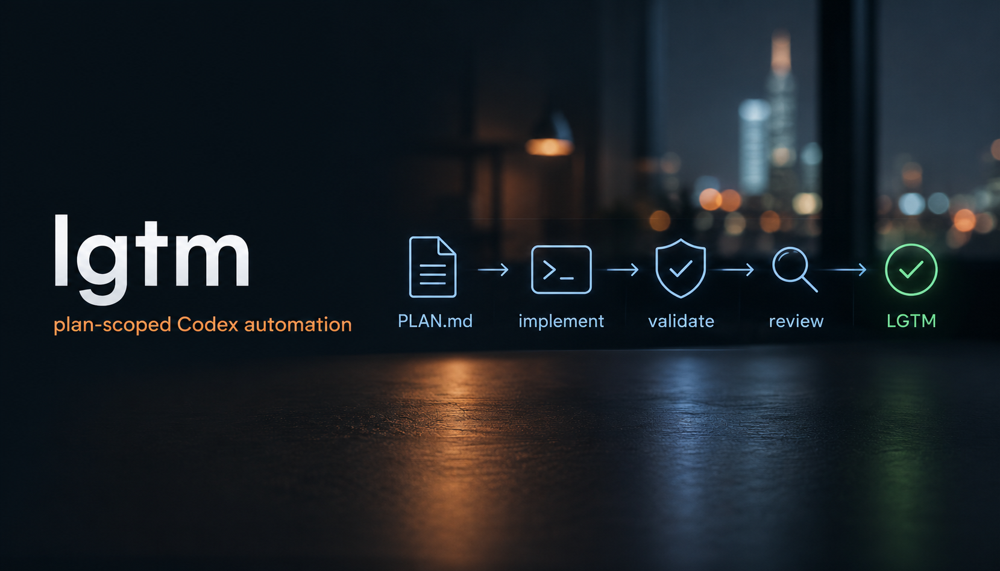

# lgtm

<div align="center">



**Run Codex through local, plan-scoped implementation, validation, and review passes.**


[Overview](#overview) • [Execution Model](#execution-model) • [Getting Started](#getting-started) • [Usage](#usage) • [Safety Model](#safety-model) • [Development](#development)

</div>

`lgtm` is a small Rust CLI for running a repo-local `PLAN.md` through a
repeatable Codex execution loop. It treats each `## Phase N - ...` or
`## Phase N: ...` heading as one bounded unit of work and runs that phase
through three local Codex passes:

1. implement the selected phase
2. validate the phase against the plan and local checks
3. review the result for scope, maintainability, and closeout issues

It is designed for repositories that already use `PLAN.md` as the
implementation order and `AGENTS.md` as the run instructions. The harness is
local by design: it does not create branches, commit, push, open PRs, or manage
CI on its own, and every pass tells Codex not to commit or push unless the user
explicitly requested that run.

> [!WARNING]
> `lgtm` runs `codex exec` with
> `--dangerously-bypass-approvals-and-sandbox` inside the target repository.
> Use it only on repositories where fully autonomous local file and command
> execution is acceptable.

## Overview

`lgtm` provides a controlled local harness around `codex exec`:

- detects phase headings such as `## Phase 1 - Skeleton` or
  `## Phase 1: Skeleton`
- runs implement, validate, and review prompts for each selected phase
- injects phase-specific instructions through lgtm-managed Codex skills
- keeps every prompt anchored to `PLAN.md`, `AGENTS.md`, and the exact phase
  heading
- reloads `PLAN.md` before each phase so earlier work can correct later phase
  definitions
- writes raw Codex JSONL logs into `.codex-log/`
- renders the live JSONL stream as a compact terminal transcript by default
- refuses to overwrite project-owned `lgtm-*` skills
- prompts before initializing Git in a target root that is not already a Git
  repository

It is intentionally not a general task runner. Its job is to move one
plan-defined phase at a time through implementation, independent validation,
and local review while preserving the target repository's scope boundaries.

## Execution Model

Before running any phase, `lgtm` verifies the target root has the configured
plan and agent instruction files, checks that existing `lgtm-*` skills are
managed by `lgtm`, ensures the target root is a Git root, and installs the
bundled skills into `.agents/skills/lgtm-*`. If Git is not initialized, it asks
before running `git init` and renaming the branch to `main`.

For each selected phase, it starts three separate `codex exec` processes:

| Pass        | Primary skill                                | Purpose                                                                                                                                                                  |
| ----------- | -------------------------------------------- | ------------------------------------------------------------------------------------------------------------------------------------------------------------------------ |
| `implement` | `lgtm-phase-implement`                       | Read the selected phase, map relevant files, implement only that phase, and run required checks.                                                                         |
| `validate`  | `lgtm-phase-validate`                        | Re-read the phase independently, compare behavior against the phase contract, fix correctness/test/docs/security/dependency/rollout gaps inside scope, and verify again. |
| `review`    | `lgtm-phase-review` plus `lgtm-final-review` | Review the final diff for maintainability, scope drift, AI slop, and closeout quality; fix only small, high-confidence phase-scoped findings.                            |

The generated prompts also call supporting skills when relevant:

- `lgtm-context-map` before implementation edits
- `lgtm-technical-spike` for unknown or version-sensitive behavior
- `lgtm-refactor-plan` for refactors, migrations, cleanup, decomposition, or
  behavior-preserving changes
- `lgtm-cli-control` and `lgtm-ui-control` for user-visible CLI/TUI or UI
  behavior
- `lgtm-security-review`, `lgtm-dependency-review`, `lgtm-rollout-review`,
  `lgtm-test-gap-review`, and `lgtm-docs-drift-review` for risk-specific
  checks
- `lgtm-plan-update` and `lgtm-spec-update` only when the selected phase exposes
  a real plan or contract gap

## Getting Started

### Prerequisites

- Rust with Cargo and Rust 2024 edition support
- Git
- the Codex CLI installed and authenticated as `codex`

### Install

Install with Homebrew:

```bash
brew install yarlson/tap/lgtm
```

From this repository:

```bash
cargo install --path .
```

Or run without installing:

```bash
cargo run -- --help
```

### Prepare a Target Repository

The target repository must contain:

- `PLAN.md`
- `AGENTS.md`
- Git initialized at the target root, or permission to initialize it when
  prompted

Minimal `PLAN.md` example:

```md
# Plan

## Phase 1 - Skeleton

Create the initial implementation and verification path.
```

> [!NOTE]
> If the target root is not a Git repository, `lgtm` asks before running
> `git init` and `git branch -M main`. Declining the prompt aborts the run.

## Usage

Run a single phase in a sibling repository:

```bash
cargo run -- --root ../lnk --start-phase 1 --end-phase 1 --sleep-seconds 0
```

Run phases from the current directory:

```bash
lgtm --start-phase 1 --end-phase 3
```

Let `lgtm` detect the final phase from `PLAN.md`:

```bash
lgtm --root /path/to/repo --start-phase 2
```

Use raw JSONL output instead of the formatted transcript:

```bash
lgtm --stream-mode raw
```

### Options

| Option            | Environment variable | Default                 | Description                                |
| ----------------- | -------------------- | ----------------------- | ------------------------------------------ |
| `--root`          | `ROOT_DIR`           | current directory       | Target repository root                     |
| `--plan-path`     | `PLAN_PATH`          | `PLAN.md`               | Plan file path under the root              |
| `--agents-path`   | `REPO_AGENTS_PATH`   | `AGENTS.md`             | Agent instruction file path under the root |
| `--start-phase`   | `START_PHASE`        | `1`                     | First phase number to run                  |
| `--end-phase`     | `END_PHASE`          | detected from `PLAN.md` | Last phase number to run                   |
| `--sleep-seconds` | `SLEEP_SECONDS`      | `600`                   | Delay between phases                       |
| `--codex-bin`     | `CODEX_BIN`          | `codex`                 | Codex executable                           |
| `--stream-mode`   | `STREAM_MODE`        | `pretty`                | `pretty` or `raw`                          |
| `--log-dir`       | `LOG_DIR`            | `.codex-log`            | Raw JSONL log directory                    |
| `--run-stamp`     | `RUN_STAMP`          | current timestamp       | Prefix for log filenames                   |

## Safety Model

`lgtm` is a strong local automation harness. It improves repeatability and
scope control, but it does not sandbox Codex. The process is intentionally
explicit:

- every pass runs `codex exec -C <root> --dangerously-bypass-approvals-and-sandbox --json -`
- Codex receives the phase prompt on stdin
- stdout is streamed and copied verbatim into a JSONL log
- stderr is inherited from the Codex process
- formatted output is only a rendering layer over the raw JSONL stream

Logs are written as:

```text
.codex-log/<run-stamp>-phase-<NN>-implement.jsonl
.codex-log/<run-stamp>-phase-<NN>-validate.jsonl
.codex-log/<run-stamp>-phase-<NN>-review.jsonl
```

Managed skills are embedded into the binary at compile time from
`skills/lgtm-*/SKILL.md`. During preflight, `lgtm` refreshes those skills in
the target repository and ensures these entries exist in the target
`.gitignore`:

```gitignore
.agents/skills/lgtm-*
.codex-log/
```

Skill installation is deliberately conservative. If a target repository already
has a `lgtm-*` skill without the expected `name` and `managed-by: lgtm`
frontmatter, `lgtm` aborts instead of overwriting project-owned instructions.

The bundled skills repeatedly tell Codex to keep work phase-scoped, avoid
unrelated cleanup, avoid later-phase work, avoid commits and pushes unless
explicitly requested, and report broad redesign or missing-environment blockers
instead of expanding the change.

## Development

Common checks are available through the `Makefile`:

```bash
make check
```

Equivalent commands:

```bash
cargo fmt --all --check
cargo clippy --all-targets --all-features -- -D warnings
cargo test --all-features
cargo build --all-targets --all-features
```

Build a release binary:

```bash
make release
```

### Release Automation

Releases are built by GitHub Actions when a `v*` tag is pushed. The tag version
must match `Cargo.toml`.

The release workflow validates with:

```bash
cargo fmt --all --check
cargo clippy --locked --all-targets --all-features -- -D warnings
cargo test --locked --all-features
```

It publishes these GitHub Release assets:

```text
lgtm-vX.Y.Z-darwin-amd64.tar.gz
lgtm-vX.Y.Z-darwin-arm64.tar.gz
lgtm-vX.Y.Z-linux-amd64.tar.gz
lgtm-vX.Y.Z-linux-arm64.tar.gz
lgtm-vX.Y.Z-windows-amd64.zip
```

Each archive has a `.sha256` checksum sidecar. The macOS and Linux checksums
are used to update `Formula/lgtm.rb` in `yarlson/homebrew-tap`; Windows assets
are published only to GitHub Releases.

The repository secret `HOMEBREW_TAP_TOKEN` must be configured with permission
to push to `yarlson/homebrew-tap`. The workflow does not store token values in
the repository.
